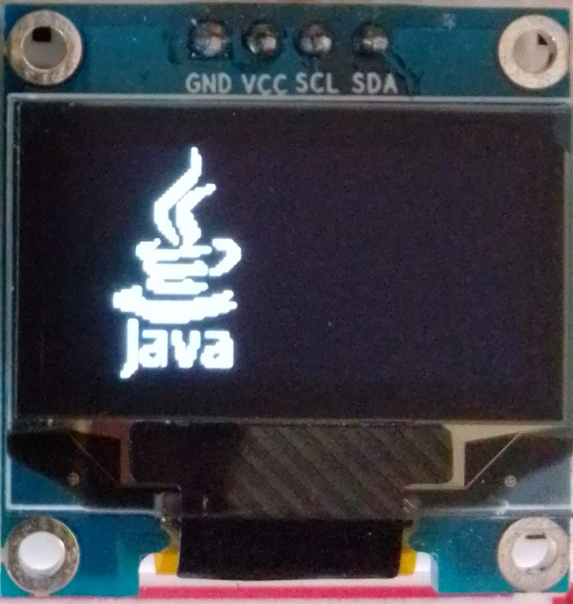
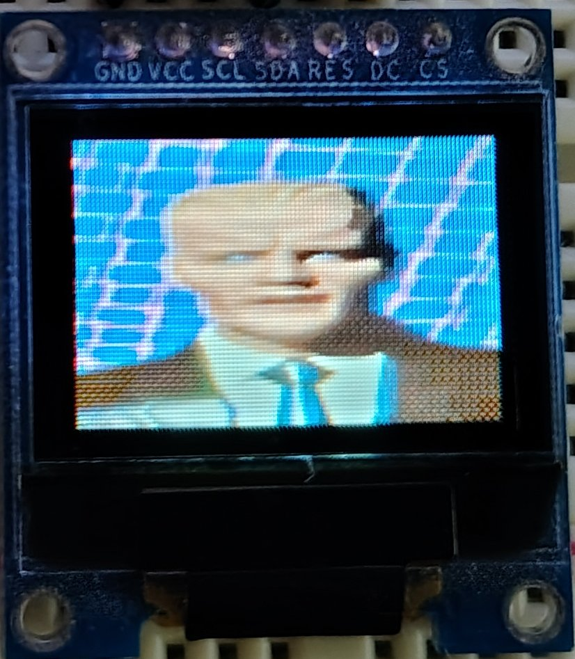
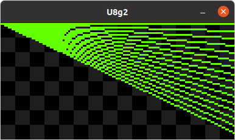

**Java UIO** offers robust Java interfaces optimized for Linux Userspace IO, emphasizing high performance. Engineered from scratch, it leverages contemporary kernel APIs, libraries, and cutting-edge code generation methodologies, embodying a state-of-the-art cross-platform solution. Rather than reinventing established paradigms, Java UIO harnesses existing standards, avoiding redundant development commonly observed in other IO libraries. Seamlessly supporting **JDK 25 LTS**, this framework integrates **Project Lombok** to streamline code, enhancing readability and conciseness.

### 🌍 The 32-bit & FFM Reality
With Java 25, there is no more support for X86_32, and ARM32 has limited JDKs available. While **FFM (Foreign Function & Memory API)** is the future, it is **not supported** on X86_32 or ARM32. For now, JavaUIO moves into the future providing a high-performance path for **ARM32**, while fully supporting **ARM64** and **X86_64**.

### Architecture Support Matrix (JDK 25)

| Architecture | JNI (Java UIO) | FFM (Project Panama) |
| :--- | :---: | :---: |
| **ARM32 (v7)** | ✅ Supported | ❌ Not Supported |
| **ARM64 (v8)** | ✅ Supported | ✅ Supported |
| **X86_32** | ❌ Not Supported | ❌ Not Supported |
| **X86_64** | ✅ Supported | ✅ Supported |
***

***
## 📦 Project Modules
* [Periphery](https://github.com/sgjava/javauio/tree/main/periphery) API for
GPIO, LED, PWM, SPI, I2C, MMIO and Serial peripheral I/O interface access. Based
on [c-periphery](https://github.com/vsergeev/c-periphery) API which also covers
C, C++, Python, Lua and Dart. Cross platform high speed MMIO based GPIO included.
* [U8g2](https://github.com/sgjava/javauio/tree/main/u8g2) API for monochrome
displays. Based on [U8g2](https://github.com/olikraus/u8g2): Library for
monochrome displays, version 2. I added ability to use multiple displays in a
thread safe way and dramatically improved software driven I2C and SPI performance
at the C level. You can also use SDL 2 based display to develop on a desktop without
physical display attached. You can choose display type and fonts at runtime.
* [Tools](https://github.com/sgjava/javauio/tree/main/tools) provides tools
for mapping MMIO GPIO register mapping, code generation, etc.
* [Demo](https://github.com/sgjava/javauio/tree/main/demo) provides CLI based
demos instead of using mocks or hard coded pins, busses, etc.

## 🛠 Technical Foundation
* An install script gives you a complete install of [JDK](https://www.azul.com/products/core),
[Maven](https://maven.apache.org), [HawtJNI](https://github.com/fusesource/hawtjni)
fork and any required projects, so there is no guessing. This can be run on the target platform
such as [Armbian](https://www.armbian.com) using Ubuntu. All testing has been done on
Armbian and Ubuntu targets while development is done on x86 and Ubuntu.
* HawtJNI generates JNI code to reduce errors and time hand coding. Updating code
is also much easier.
    * Generates JNI source code.
    * Generates an autoconf and msbuild source project to build the native library.
This gets attached to the Maven project as as the native source zip file.
    * Builds the native source tar for the current platform.
    * Built native library is stored in a platform specific jar. This gets attached
to the Maven project as a platform specific jar file.
* Why Linux userspace? This is really the only way to get cross platform
libraries to work since most SBCs have different chip sets. The trade off is
performance compared to native C written to specific chip sets. However, since
I'm wrapping C with JNI it guarantees the fastest userspace experience for Java.
* Why Armbian? Because Armbian supports many SBCs and the idea is to be truly
SBC cross platform. See [downloads](https://www.armbian.com/download).
* Why Java 25? Because Java 25 is the current LTS version of Java.I'm only moving
forward with Java. You can always create a fork and make a version of Java UIO
based on another version.
* Why OpenJDK? Because it's easy to download without all the crap Oracle puts you
through. You can always use another JDK 25 vendor, but you will have to do that
manually.

## 🔧 SBC Configuration
* If you are using Armbian then use `armbian-config` or edit `/boot/armbianEnv.txt`
to configure various devices. Userspace devices are exposed through /dev or
/sys. Verify the device is showing up prior to trying demo apps.
    * `sudo apt install armbian-config`
* If you are not using Armbian then you will need to know how to configure
devices to be exposed to userspace for your Linux distribution and SBC model.
Check each log in scripts directory to be sure there were no errors after running
install.sh.
* Since linux 4.8 the GPIO sysfs interface is [deprecated](https://www.kernel.org/doc/html/latest/admin-guide/gpio/sysfs.html).
Userspace should use the character device instead.
* I have tested 32 bit and 64 bit boards using the latest Armbian release or in
the case of the Raspberry Pi Ubuntu Server. The ability to switch seamlessly
between boards gives you a wide range of SBC choices.

## Non-root access
Non-root access is provided by a systemd service called [uio-permissions](https://github.com/sgjava/javauio/blob/6ea3ef5155f3158d92eb16b5f428372ec8adda3d/scripts/install.sh#L44) that
applies permissions for GPIO, I2C, SPI, serial and system LEDs. GPIO
sysfs (deprecated) and PWM permissions are provided by udev rules. Tweak [uio-permissions.sh](https://github.com/sgjava/javauio/blob/main/scripts/uio-permissions.sh)
[98-sysfs.rules](https://github.com/sgjava/javauio/blob/main/scripts/98-sysfs.rules) and
[99-pwm.rules](https://github.com/sgjava/javauio/blob/main/scripts/99-pwm.rules)
as needed.

## Download project
* `sudo apt install git`
* `cd ~/`
* `git clone --depth 1 https://github.com/sgjava/javauio.git`

## 🚀 Install script
The install script assumes a clean OS install. If you would like to install on
a OS with your own version of Java 25, etc. then you can look at what install-java.sh
does and do it manually. What do the scripts do?
* Install Java 25 JDK, Maven and Ant using SDKMAN
* Install build dependencies
* Install UIO Permissions Service and udev rules
* Build HawtJNI (using my fork that works with JDK 25)
* Download and copy c-periphery source to Maven module
* Download and copy U8g2 source to Maven module
* Build Java UIO

### Run script
* `cd ~/javauio/scripts`
* `./install-java.sh`
* `./install.sh`
* Check various log files if you have issues running the demo code. Something
could have gone wrong during the build/bindings generation processes.
    * `tail -n 1 install.log` total build time
    * `tail -n 12 javauio.log` make sure all modules show SUCCESS
* Make sure you use latest [gpio.h](https://github.com/sgjava/javauio/tree/main/periphery#build-periphery-with-proper-gpioh)
* If you need to recompile use
    * `cd ~/javauio`
    * `mvn clean install`

## 💻 Developer Guide
I'm using NetBeans to develop, but this is a standard Maven multi-module project.
The easiest way to setup your environment is create a Ubuntu 24.04 desktop VM
(VirtualBox, etc.) and follow install process since it installs JVM, Maven, all
projects, etc. Then you just need to install NetBeans (or Eclipse, etc.).
Since Java UIO relies on c-periphery and u8g2 those files are not included in the
project. You can see them ignored in .gitignore.
* Copy the c-periphery files to `javauio/periphery/src/main/native-package/src`
* Copy u8g2 files to `javauio/u8g2/src/main/native-package/src`

Now you should be ready to compile the project with `mvn clean install`. To use
NetBeans right-click Run on a program in Demo project modify project properties:
* Click actions
* Click Run file via main()
    * `exec.classpath=/home/youruser/NetBeansProjects/javauio/u8g2/target/u8g2-1.0.0-SNAPSHOT-linux64.jar:/home/youruser/NetBeansProjects/javauio/periphery/target/periphery-1.0.0-SNAPSHOT-linux64.jar`
    * `exec.appArgs=--type=SDL`
 * Click OK

Now if you run SimpleText it will use SDL instead of a real display. You will
need to tweak for Periphery demo programs as well. Basically look at the command
line arguments in the examples provided.