Java UIO Demo provides CLI programs, so you do not have to compile code with
hard coded pins, ports, etc. Note that the native library jar has a suffix such
as linux32, so depending on your target platform it could be different.
 
## Run Periphery demos
 To see a list of demos 
[browse](https://github.com/sgjava/javauio/tree/main/demo/src/main/java/com/codeferm/periphery/demo)
code. Just pass in --help to get list of command line arguments.

* `java --enable-native-access=ALL-UNNAMED -cp $HOME/javauio/demo/target/demo-1.0.0-SNAPSHOT.jar:$HOME/javauio/periphery/target/periphery-1.0.0-SNAPSHOT-linux32.jar com.codeferm.periphery.demo.LedBlink --help`

## Run U8g2 demos
To see a list of demos 
[browse](https://github.com/sgjava/javauio/tree/main/demo/src/main/java/com/codeferm/u8g2/demo)
code. Just pass in --help to get list of command line arguments.

* `java --enable-native-access=ALL-UNNAMED -cp $HOME/javauio/demo/target/demo-1.0.0-SNAPSHOT.jar:$HOME/javauio/u8g2/target/u8g2-1.0.0-SNAPSHOT-linux32.jar com.codeferm.u8g2.demo.SimpleText --help`

### U8g2 Demo Suite: Beyond the Basics

This collection of demos demonstrates the high-performance JNI bindings of JavaUIO, moving from simple text to complex real-time graphics and system monitoring.

### Core Graphics & Performance
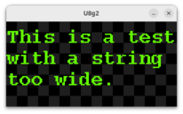
* SimpleText.java: The essential starting point. It demonstrates how to initialize the display, select fonts, and render strings with minimal overhead.
Line wrapping is built in as well.

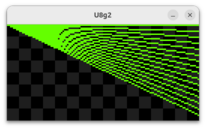
* Draw.java: A comprehensive test of the U8g2 primitive API. It exercises lines, boxes, circles, and frames to verify that geometric rendering is crisp and accurate across the JNI bridge.
* Perf.java: A stress-test demo designed to measure frames per second (FPS). It pushes the library to its limits to prove that JavaUIO provides a near-native experience for high-frequency updates.

* BufImage.java: Showcases the ability to bridge Java's BufferedImage with U8g2’s native buffers. This is critical for developers who want to use standard Java 2D drawing tools and then "flush" the result to a monochrome OLED/LCD.

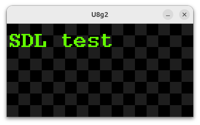
* Sdl.java is a simple demo the checks for display type then displays message. All demos work with SDL except multi-display enable demos.
### Advanced Visuals & Games
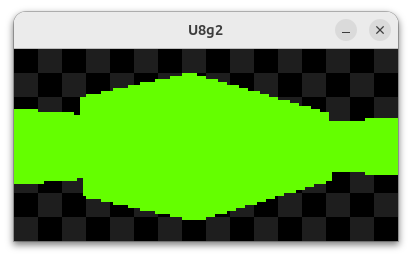
* Raycast.java: A sophisticated demo implementing a "pseudo-3D" raycasting engine (similar to Wolfenstein 3D). It demonstrates that the library is fast enough to handle complex per-pixel calculations and real-time perspective rendering.

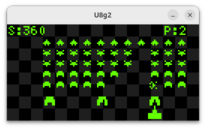
* SpaceInvaders.java: A classic arcade implementation that serves as a masterclass in game loop logic, collision detection, and sprite management within the monochrome constraints of U8g2.

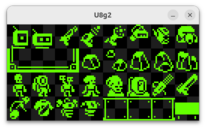
* SpriteSheet.java: Demonstrates how to handle tile sheets by slicing and rendering specific frames from a larger image sheet—essential for efficient memory usage in complex UIs.

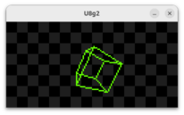
* WireframeCube.java uses math and drawing primitives to animate rotating 3D wireframe cube. No cheating with sprites here.

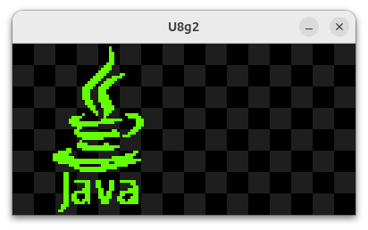
* Xbm.java: Updated for the latest U8g2 version, this demo shows how to load and display X BitMap files, which is the standard for custom icons and branding on monochrome screens.

### Real-World Applications
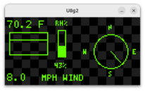
* WeatherStation.java: A practical dashboard example that combines custom icons, data formatting, and layout management to create a functional, information-dense display.

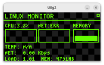
* LinuxMonitor.java: A system utility demo that pulls real-time stats (CPU, Memory, etc.) from the Linux OS and displays them on the hardware, turning your small OLED into a dedicated system monitor.

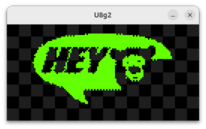
* Video.java: Pushes the boundaries of monochrome displays by streaming video frames. It demonstrates highly optimized buffer transfers to achieve fluid playback on I2C/SPI screens.

### Architecture & Portability

* MultiDisplay.java: Showcases the unique thread-safe capability of JavaUIO, allowing a single Java application to drive multiple physical displays independently without resource conflicts.
This will not work on SDL displays.
## Run U8g2 plus Periphery demos
To see a list of demos 
[browse](https://github.com/sgjava/javauio/tree/main/demo/src/main/java/com/codeferm/all/demo)
code. Just pass in --help to get list of command line arguments.

* `java --enable-native-access=ALL-UNNAMED -cp $HOME/javauio/demo/target/demo-1.0.0-SNAPSHOT.jar:$HOME/javauio/periphery/target/periphery-1.0.0-SNAPSHOT-linux32.jar:$HOME/javauio/u8g2/target/u8g2-1.0.0-SNAPSHOT-linux32.jar com.codeferm.all.demo.LedDisplay --help`
