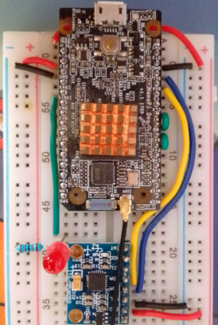

Periphery is a high performance library for GPIO, LED, PWM, SPI, I2C, MMIO
and Serial peripheral I/O interface access in userspace Linux.
* Cross platform MMIO GPIO that doesn't require one off code for each board. Only
a simple property file is required to map registers.
* All wrapper classes support AutoCloseable, so you can use the
[try-with-resources](https://docs.oracle.com/javase/tutorial/essential/exceptions/tryResourceClose.html)
statement to automatically close and free native resources. This prevents hard
to track down native resource leaks.
```
try (final var spi = new Spi("/dev/spidev1.0", 0, 500000)) {
    final var txBuf = new byte[128];
    // Change some data at beginning and end.
    txBuf[0] = (byte) 0xff;
    txBuf[127] = (byte) 0x80;
    final var rxBuf = new byte[128];
    Spi.spiTransfer(spi.getHandle(), txBuf, rxBuf, txBuf.length);
    logger.info(String.format("%02X, %02X", (short) rxBuf[0] & 0xff, (short) rxBuf[127] & 0xff));
}
```



NanoPi Duo rigged up to test Periphery including serial and SPI loopbacks, MPU6050 to test I2C and Led.
Built in button and system Led can also be tested all without mocks.

Periphery will be targeting Armbian, but the code should work with most
Linux distributions. Demo apps are included that illustrate how to leverage the
bindings. The idea is to have consistent APIs across
[C](https://github.com/vsergeev/c-periphery),
[Python](https://github.com/vsergeev/python-periphery),
[Lua](https://github.com/vsergeev/lua-periphery),
[Dart](https://github.com/pezi/dart_periphery) and JVM languages without having
to use one off board specific drivers, 
[deprecated wiringPi](http://wiringpi.com/wiringpi-deprecated) or the
[deprecated sysfs](https://www.kernel.org/doc/html/latest/admin-guide/gpio/sysfs.html)
interface.

## Armbian and built in buttons
On the NanoPi Duo the built in button causes it to shutdown by default. You can
remove the r_gpio_keys section in the DTB as follows (this may work on other SBCs,
but you'll need to know the correct dtb file and section to remove) :
* `cd /boot/dtb`
* `sudo cp sun8i-h2-plus-nanopi-duo.dtb sun8i-h2-plus-nanopi-duo.dtb.old`
* `sudo dtc -@ -I dtb -O dts -o sun8i-h2-plus-nanopi-duo.dts sun8i-h2-plus-nanopi-duo.dtb`
* `sudo nano sun8i-h2-plus-nanopi-duo.dts`
    * Remove `gpio-keys` section
* `sudo dtc -@ -I dts -O dtb -o sun8i-h2-plus-nanopi-duo.dtb sun8i-h2-plus-nanopi-duo.dts`
* `reboot`

## Armbian I2C frequency
On Armbian you can change I2c frequency. Seems only 100 KHz and 400 KHz
is supported by kernel. Here we do it on the NanoPi Duo.
* Use same steps as above to copy dtb and edit it.
* `sudo nano sun8i-h2-plus-nanopi-duo.dts`
    * Search for `i2c@` sections and add 400 KHz clock frequency.
    * `clock-frequency = <400000>;`
* `sudo dtc -@ -I dts -O dtb -o sun8i-h2-plus-nanopi-duo.dtb sun8i-h2-plus-nanopi-duo.dts`
* `reboot`

## Modify POM as needed
The Periphery POM uses download-maven-plugin to download c-periphery source
to `src/main/native-package/src`. The files are cached in
`~/.m2/repository/.cache/download-maven-plugin`, so they are not downloaded
again unless they are updated. If you want to build the GPIO C code to use sysfs
comment out `-DPERIPHERY_GPIO_CDEV_SUPPORT=1` from `<configureArgs>` in the
`hawtjni-maven-plugin` section of the POM.

### Build periphery with proper gpio.h
The gcc default include paths usually do not point to the latest gpio.h header.
In order to use the latest features in c-periphery you will need to use the
correct gpio.h include. After the install.sh script completes:
* `sudo armbian-config` Kernel, Install kernel headers
* `grep -R -i "GPIOHANDLE_REQUEST_BIAS_DISABLE" /usr/src`
* `mkdir -p $HOME/include/linux`
* `cp /usr/src/linux-headers-5.9.11-sunxi/include/uapi/linux/gpio.h $HOME/include/linux/.` (use actual path)
* `cd ~/javauio/periphery`
* `mvn clean install "-DCFLAGS=-I$HOME/include"`
* Add `-Dmaven.compiler.source=11 -Dmaven.compiler.target=11` for ARM32 JDK 11 if needed

## High performance GPIO using MMIO
I have created a generic way to achieve fast GPIO for times when performance (bit
banging, software based PWM, low CPU latency, etc) is required. I have written a
mapper, so you can extract the  data register masks without having to do it by
hand from the datasheet. Doing this totally by hand is tedious and error prone.
The method I use is using a well know interface (GPIO device) to make changes
and detecting register deltas. You still need to create a [input file](https://github.com/sgjava/javauio/blob/main/periphery/src/main/resources/duo.properties)
with various board specific parameters. Make sure you disable all hardware in
armbian-config System, Hardware and remove console=serial from
/boot/armbianEnv.txt. You want multi-function pins to act as GPIO pins.

Check out [Tools](https://github.com/sgjava/javauio/tree/main/tools) module for examples of running the MMIO GPIO tools.

As you can see above the same performance test code works on a 32 bit H2+ and a
64 bit H5 CPU. This means almost all boards can be easily supported with
the right input file. This is probably the only high performance GPIO code that
is truly cross platform. No custom adapters or other one off code is required
currently. Also, I use the same pin numbers as the GPIO device, so no goofy
wiringPi or BCM pin numbering. Keep in mind that only one core is used, so the 
CPU will never exceed 25% on a quad core system.

If you want to map your own board you start by getting the data sheet and
finding the data registers. I've written a little memory tool
[MemScan](https://github.com/sgjava/javauio/blob/main/tools/src/main/java/com/codeferm/periphery/mmio/MemScan.java)
that will allow you to see what bits change for a range of registers using mode,
data and pull operations.

## GPIO Performance using Perf
Note that most performance tests focus on writes and not CPU overhead, so it's
hard to compare. Technically you will actually be doing something like bit
banging to simulate a protocol, so you need extra CPU bandwidth to do that.
Please note write frequency is based on square wave (rapid on/off). You can
increase clock speed to improve performance on some boards. I used the OS
defaults. Speed was validated on an oscilloscope, so Perf test may show better
performance.

|SBC               |OS           |CPU Freq|GPIOD Write KHz|MMIO Write KHz|Average CPU|
| ---------------- | ----------- | ------ | ------------- | ------------ | --------- |
|Nano Pi Duo v1.0  |Armbian nobel|1.0 GHz |242            |1880          |25%        |
|Nano Pi M1        |Armbian nobel|1.2 GHz |320            |2355          |25%        |
|Nano Pi Neo Plus2 |Armbian nobel|1.0 GHz |347            |2356          |25%        |
|Odroid C2         |Armbian nobel|1.5 GHz |365            |2346          |25%        |
|Odroid XU4        |Armbian nobel|2.0 GHz | 44            | 300          |12%        |
|Raspberry Pi 3    |Ubuntu nobel |1.2 GHz |119            |4541          |25%        |
|Orange Pi PC Plus |Armbian nobel|1.3 GHz |314            | 886          |25%        |

## How GPIO pins are mapped
This is based on testing on a NanoPi Duo. gpiochip0 starts at 0 and gpiochip1
starts at 352. Consider the following table:

|Name                           |Chip Name |dev |sysfs|
| ----------------------------- | -------- | -- | --- |
|DEBUG_TX(UART_TXD0)/GPIOA4     |gpiochip0 | 004|  004|
|DEBUG_RX(UART_RXD0)/GPIOA5/PWM0|gpiochip0 | 005|  005|
|I2C0_SCL/GPIOA11               |gpiochip0 | 011|  011|
|I2C0_SDA/GPIOA12               |gpiochip0 | 012|  012|
|UART3_TX/SPI1_CS/GPIOA13       |gpiochip0 | 013|  013|
|UART3_RX/SPI1_CLK/GPIOA14      |gpiochip0 | 014|  014|
|UART3_RTS/SPI1_MOSI/GPIOA15    |gpiochip0 | 015|  015|
|UART3_CTS/SPI1_MISO/GPIOA16    |gpiochip0 | 016|  016|
|UART1_TX/GPIOG6                |gpiochip0 | 198|  198|
|UART1_RX/GPIOG7                |gpiochip0 | 199|  199|
|GPIOG11                        |gpiochip0 | 203|  203|
|ON BOARD BUTTON                |gpiochip1 | 003|  355|
|GPIOL11/IR-RX                  |gpiochip1 | 011|  363|

So basically you just need to know the starting number for each chip and realize
GPIO character devices always starts at 0 and calculate the offset. Thus gpiochip1
starts at 352 and the on board button is at 355, so 355 - 352 = 3 for GPIO
character device.

## Use Periphery in your own Maven projects
After bulding Periphery simpily add the following artifact:
```
<groupId>com.codeferm</groupId>
<artifactId>periphery</artifactId>
<version>1.0.0-SNAPSHOT</version>
```
