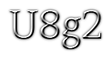
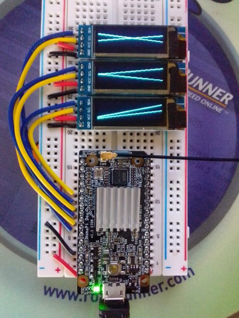

U8g2 for Java is a high-performance JNI wrapper based on [U8g2](https://github.com/olikraus/u8g2): the definitive library for monochrome displays.

By using custom automation to generate HawtJNI methods and font constants, this project ensures the Java API remains in lock-step with the underlying C library. This makes updates seamless and maintenance trivial.

## Architecture: Why JavaUIO U8g2 Doesn't Require AWT

Some popular Java libraries use a wrapper around java.awt.Graphics2D. This forces the JVM to load the entire AWT/headless subsystem just to draw a single pixel. JavaUIO U8g2 bypasses this entirely because:

* Native Rendering Engine: All drawing logic (lines, circles, boxes, and fonts) is handled by the native C library (U8g2). When you call u8g2.drawStr(), you are passing coordinates and strings directly to optimized C code that manipulates a memory buffer.
* Direct Bit Mapping: U8g2 is designed for monochrome displays. It draws directly into a 1-bit-per-pixel buffer. Java’s BufferedImage typically operates in 32-bit (ARGB) or 16-bit color, requiring a "downsampling" step (conversion) that is computationally expensive on SBCs like the Raspberry Pi.
* No Headless Requirement: On many Linux distributions, running AWT code requires installing libawt or openjdk-X-jre-headless. JavaUIO U8g2 only requires the tiny native shared library (.so) inside the shaded jar.
* If you want to use AWT I have you covered. Look at [BufImage](https://github.com/sgjava/javauio/blob/main/demo/src/main/java/com/codeferm/u8g2/demo/BufImage.java) demo.

## Key Features

* **Massive Hardware Support:** Access to **~200 monochrome display controllers** and over **700 high-quality fonts** out of the box.
* **Authentic API:** The Java code strictly follows the C API. If you have used U8g2 in C, C++, or NodeMcu (Lua), the methods will be immediately familiar. No "heavy" Java abstractions—just the raw power of U8g2.
* **Dynamic Configuration:** The [Display](https://github.com/sgjava/javauio/blob/main/u8g2/src/main/java/com/codeferm/u8g2/Display.java) class allows for runtime setup and font selection. Build applications that don't need to know the display or font type at compile time.
* **Desktop Simulation:** Works with **SDL 2**, allowing you to develop and debug your UI on your desktop without needing a physical display or a logic analyzer.
* **Performance & Reliability:** This includes my PRs for the [arm-linux](https://github.com/olikraus/u8g2/tree/master/sys/arm-linux) port, making it thread-safe and multi-display capable. It also features optimized I2C and SPI software drivers for embedded Linux.

Do it all yourself U8g2 style.

```
final var u8g2 = U8g2.initU8g2();
// Change this to your actual display
U8g2.setupSsd1306I2c128x64NonameF(u8g2, U8G2_R0, u8x8_byte_arm_linux_hw_i2c, u8x8_arm_linux_gpio_and_delay);
U8g2.initI2cHw(u8g2, 0);
U8g2.setI2CAddress(u8g2, 0x3c * 2);
U8g2.initDisplay(u8g2);
logger.debug(String.format("Size %d x %d, draw color %d", U8g2.getDisplayWidth(u8g2), U8g2.getDisplayHeight(u8g2), U8g2.
        getDrawColor(u8g2)));
U8g2.setPowerSave(u8g2, 0);
U8g2.clearBuffer(u8g2);
U8g2.setFont(u8g2, u8g2_font_t0_15b_mf);
U8g2.drawStr(u8g2, 1, 18, "U8g2");
U8g2.sendBuffer(u8g2);
try {
    TimeUnit.SECONDS.sleep(5);
} catch (InterruptedException ie) {
    Thread.currentThread().interrupt();
}
U8g2.setPowerSave(u8g2, 1);
U8g2.doneUserData(u8g2);
U8g2.doneI2c();
```

Or look at the [Base](https://github.com/sgjava/javauio/blob/main/demo/src/main/java/com/codeferm/u8g2/demo/Base.java) class in Demo module.

```
var exitCode = super.call();
showText("Hello world.");
done();
```




Check out all the [demos](https://github.com/sgjava/javauio/tree/main/demo/src/main/java/com/codeferm/u8g2/demo).
You will find quite a sophisticated selection. 

SSD1306 sendBuffer performance based on JDK 25 and Nano Pi Duo.

|Setup                       |Type |Bus KHz | FPS  |
| -------------------------- | --- | ------ | ---- |
|SSD1306_I2C_128X64_NONAME   |HW   |     100|  8.85|
|SSD1306_I2C_128X64_NONAME   |HW   |     400| 30.30|
|SSD1306_I2C_128X64_NONAME   |SW   |     189| 14.49|
|SSD1306_I2C_128X32_UNIVISION|SW   |     189| 28.57|
|SSD1306_128X64_NONAME       |HW   |     500| 50.00|
|SSD1306_128X64_NONAME       |HW   |    1000|100.00|
|SSD1306_128X64_NONAME       |HW   |    2000|200.00|
|SSD1306_128X64_NONAME       |SW   |     189| 19.61|

## Use Java u8g2 in your own Maven projects
After bulding Java u8g2 simpily add the following artifact:
```
<groupId>com.codeferm</groupId>
<artifactId>u8g2</artifactId>
<version>1.0.0-SNAPSHOT</version>
```
